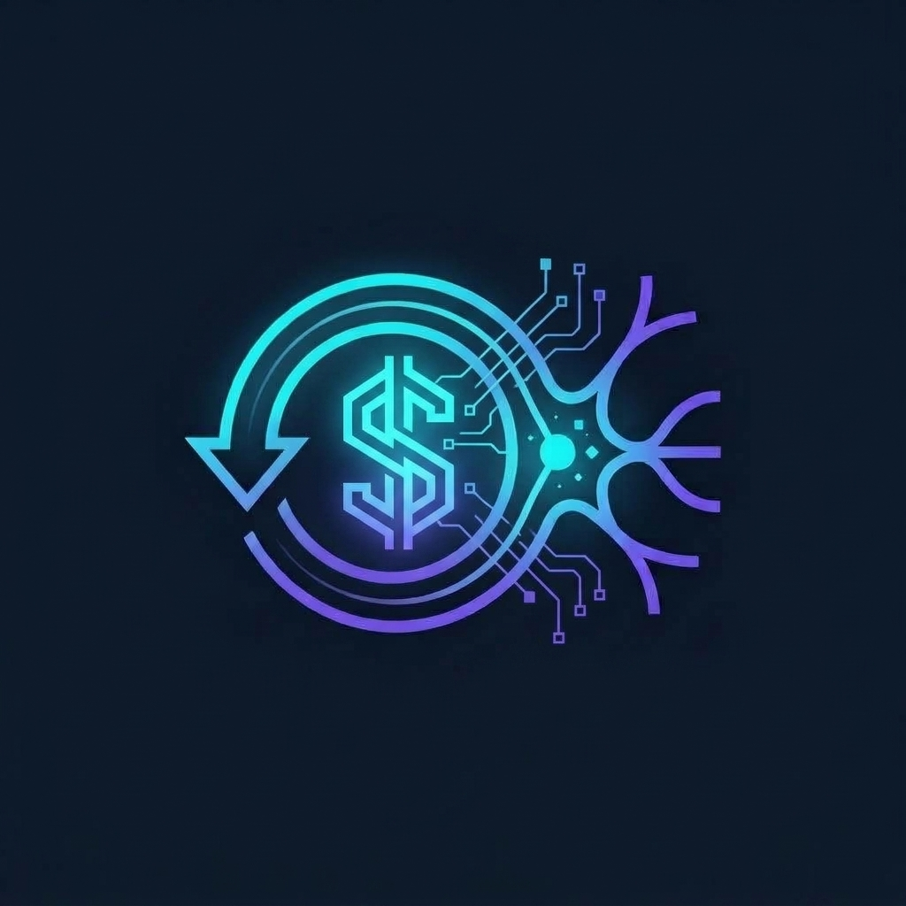

<p align="center">
  
</p>

<h1 align="center">NeuroZero Replay: Agentic Computer-Use & Deterministic Replay Engine</h1>

<p align="center">
  <strong>Autonomous LLM Discovery • Zero-LLM Deterministic Replay • Playwright Core</strong>
</p>

<p align="center">
  <a href="https://github.com/AaschitaReddyM/neuro_zero_replay/actions"></a>
  <a href="https://www.python.org/downloads/"></a>
  <a href="https://playwright.dev/python/"></a>
  <a href="LICENSE"></a>
</p>

---

## Executive Summary

NeuroZero Replay is an enterprise automation platform designed for applications that lack programmatic APIs. It operates across two complementary phases:
1. **Autonomous Discovery (LLM)**: An AI agent observes the live accessibility tree and DOM, reasons over user intent, navigates forms, parameterizes inputs (`{{member_id}}`), and records a structured, reusable capability artifact.
2. **Zero-LLM Deterministic Replay**: The generated artifact is replayed with native Playwright locators (`get_by_role`, `get_by_label`, `get_by_text`) and auto-waiting—completely bypassing the LLM to deliver fast, low-cost, and deterministic execution.

```mermaid
flowchart TD
    subgraph Discovery_Phase ["Phase 1: Autonomous LLM Discovery"]
        A[User Goal / Intent] --> B[Agent Orchestrator]
        B --> C[Browser Automation Layer (Playwright)]
        C --> D[Target Web Application :8080]
        D --> E[Accessibility Tree & DOM Snapshot]
        E --> F[LLM Client (Gemini / OpenAI)]
        F -->|Observe-Decide-Act Loop| B
    end

    subgraph Artifact_Compilation ["Contract Compilation"]
        B -->|Checkpoint Verified| G[Automation Artifact JSON]
        G --> H[Artifact Marketplace & Schema Validation]
    end

    subgraph Replay_Phase ["Phase 2: Zero-LLM Deterministic Replay"]
        H --> I[Replay Engine]
        I --> J[Parameter Substitution & Allowlist Validation]
        J --> K[Playwright Native Locators]
        K --> L[Actionability Auto-Waiting & Strategy Fallbacks]
        L --> M[Checkpoint & Business Outcome Verification]
        M --> N[Structured ExecutionResult]
    end
```

---

## Prerequisites & Installation

### 1. Requirements
- Python 3.10, 3.11, or 3.12
- Node.js runtime (for Playwright browser engines)
- Google Gemini API Key or OpenAI API Key (only required for Phase 1 Discovery; Replay runs 100% locally with zero API keys)

### 2. Setup
```bash
# Clone the repository
git clone https://github.com/AaschitaReddyM/neuro_zero_replay.git
cd neuro_zero_replay

# Create virtual environment and install dependencies
python -m venv .venv
# On Windows:
.venv\Scripts\activate
# On Linux/macOS:
source .venv/bin/activate

pip install -r requirements.txt
playwright install --with-deps chromium

# Configure environment
cp .env.example .env
# Edit .env and configure your GEMINI_API_KEY or OPENAI_API_KEY
```

---

## End-to-End Execution Walkthrough

All commands below are directly runnable against the included target application.

### Step 1: Start the Target Application
Start the core banking portal on `http://localhost:8080`:
```bash
python -m http.server 8080 --directory target-app
```
*(Leave running in a background terminal or use a separate window)*

### Step 2: Live LLM Capability Discovery
Run autonomous discovery to generate a parameterized artifact:
```bash
python main.py discovery \
  --goal "Look up member 12345 and read their current savings balance" \
  --target-url http://localhost:8080 \
  --capability-name lookup_member_balance \
  --description "Look up member account balance and profile information"
```
- **What happens**: The LLM inspects the accessibility tree, fills the Member ID field, clicks Search, extracts the balance, verifies the `#lookup-result` checkpoint, and persists `evidence/artifacts/lookup_member_balance.json` with per-step screenshots in `evidence/discovery_run_<ts>/`.

### Step 3: Deterministic Replay (Success Path)
Replay the generated artifact with a different member (`67890` - Jane Johnson) with zero LLM calls:
```bash
python main.py replay \
  --artifact evidence/artifacts/lookup_member_balance.json \
  --params '{"member_id":"67890"}'
```
- **Observed Result**: Executes in ~1.8s. Emits status `success`, extracts Jane Johnson's `$12,500.00` checking balance, and verifies checkpoint.

### Step 4: Business Outcome Detection
Replay with a non-existent member ID (`99999`):
```bash
python main.py replay \
  --artifact evidence/artifacts/lookup_member_balance.json \
  --params '{"member_id":"99999"}'
```
- **Observed Result**: Emits status `business_outcome` with identifier `member_not_found`. Intercepted cleanly without triggering false technical alarms or timeouts.

### Step 5: Policy Risk Gating
Attempt to execute the account freeze capability without approval:
```bash
python main.py replay \
  --artifact evidence/artifacts/account_management.json \
  --params '{"member_id":"12345"}'
```
- **Observed Result**: Halts at Step 6 (`Freeze Account`) with status `needs_confirmation` and captures an audit screenshot.
- **To authorize execution**:
```bash
python main.py replay \
  --artifact evidence/artifacts/account_management.json \
  --params '{"member_id":"12345"}' \
  --approve-risky
```

### Step 6: Run Verification Test Suite
```bash
# Run pytest suite (20 tests covering taxonomy, safety, discovery contracts, and escalation)
python -m pytest -v

# Run baseline probe audit
python tests/probe_audit.py
```

---

## Core System Architecture & Modules

| Module | Location | Primary Responsibilities |
| :--- | :--- | :--- |
| **Agent Orchestrator** | `src/agent/orchestrator.py` | Observe-decide-act loop, input parameterization (`{{member_id}}`), transcript logging. |
| **LLM Client** | `src/agent/llm_client.py` | Asynchronous REST integration for Google Gemini and OpenAI; JSON schema enforcement. |
| **Browser Automation** | `src/automation/browser.py` | Playwright abstraction, native locators (`get_by_role`, `get_by_label`), auto-waiting. |
| **Replay Engine** | `src/artifact/replay_engine.py` | Zero-LLM deterministic replay, parameter substitution, checkpoint verification. |
| **Safety Guardrails** | `src/safety/guardrails.py` | Pre-navigation & post-action domain allowlists, risk gating, recursive PII redaction. |
| **Escalation Manager** | `src/safety/escalation.py` | Control transfer state machine, session keeping, intervention records, resume signaling. |
| **Artifact Marketplace**| `src/artifact/marketplace.py`| Cataloging, metadata indexing, and capability discovery. |

---

## Evidence & Verification Logs

Real execution records generated from local test runs:
- `evidence/artifacts/lookup_member_balance.json`: The live-discovered parameterized artifact.
- `evidence/discovery_run_20260914_234448/`: Per-step screenshots and JSON transcript from live Gemini discovery.
- `evidence/discovery_run.log`: Console execution trace of discovery run.
- `evidence/replay_success_run.log`: Replay execution log for member `67890` (Jane Johnson).
- `evidence/replay_business_outcome_run.log`: Replay log demonstrating `member_not_found` business outcome handling.
- `evidence/replay_escalation_run.log`: Replay log demonstrating live human escalation and session resumption.
- `evidence/interventions/`: Structured intervention audit records.

---

## License

This project is licensed under the MIT License — see the [LICENSE](LICENSE) file for details.