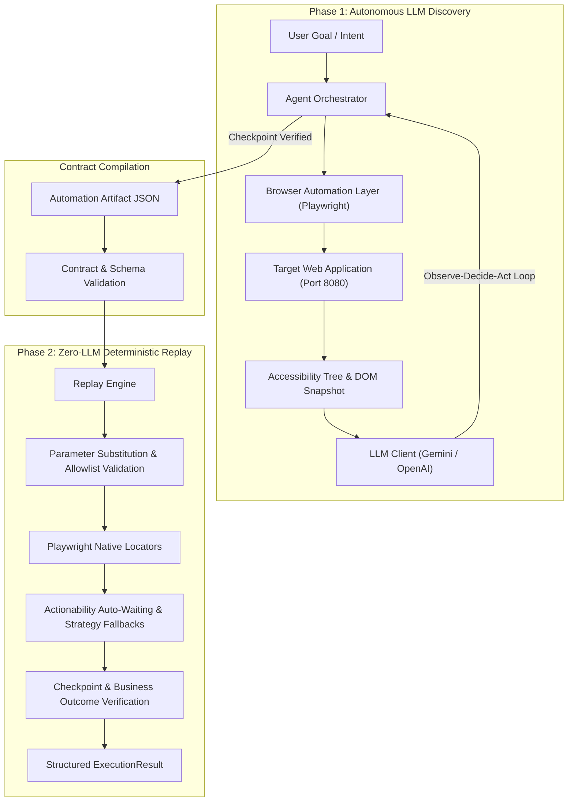

<p align="center">
  
</p>

<h1 align="center">NeuroZero Replay: Agentic Computer-Use & Deterministic Replay Engine</h1>

<p align="center">
  <strong>Autonomous LLM Discovery • Zero-LLM Deterministic Replay • Playwright Core</strong>
</p>

<p align="center">
  <a href="https://github.com/AaschitaReddyM/neuro_zero_replay/actions"></a>
  <a href="https://www.python.org/downloads/"></a>
  <a href="https://playwright.dev/python/"></a>
  <a href="LICENSE"></a>
</p>

---

## Executive Summary

NeuroZero Replay is an enterprise automation platform designed for applications that lack programmatic APIs. It operates across two complementary phases:
1. **Autonomous Discovery (LLM)**: An AI agent observes the live accessibility tree and DOM, reasons over user intent, navigates forms, parameterizes inputs (`{{member_id}}`), and records a structured, reusable capability artifact.
2. **Zero-LLM Deterministic Replay**: The generated artifact is replayed with native Playwright locators (`get_by_role`, `get_by_label`, `get_by_text`) and auto-waiting—completely bypassing the LLM to deliver fast, low-cost, and deterministic execution.



---

## Prerequisites & Installation

### 1. Requirements
- Python 3.10, 3.11, or 3.12
- Node.js runtime (for Playwright browser engines)
- Google Gemini API Key or OpenAI API Key (only required for Phase 1 Discovery; Replay runs 100% locally with zero API keys)

### 2. Setup
```bash
# Clone the repository
git clone https://github.com/AaschitaReddyM/neuro_zero_replay.git
cd neuro_zero_replay

# Create virtual environment and install dependencies
python -m venv .venv
# On Windows:
.venv\Scripts\activate
# On Linux/macOS:
source .venv/bin/activate

pip install -r requirements.txt
playwright install --with-deps chromium

# Configure environment
cp .env.example .env
# Edit .env and configure your GEMINI_API_KEY or OPENAI_API_KEY
```

---

## End-to-End Execution Walkthrough (Demo Running Instructions)

The instructions below reflect the exact demonstration path used during live technical reviews. All commands are directly runnable against the included target banking application.

### Target Banking Portal Test Profiles
During live testing and demonstration, use this reference table to select member accounts corresponding to the required visual state:

| Member ID | Member Name | Account Status | UI Theme & Badge | Balance & Type | Demo Purpose & Workflow |
| :--- | :--- | :--- | :--- | :--- | :--- |
| **`12345`** | John Smith | **Active** | 🟢 `● ACTIVE` (Green card) | $5,432.50 (Savings) | Baseline Discovery & Replay (Steps 2 & 4) |
| **`67890`** | Jane Johnson | **Active** | 🟢 `● ACTIVE` (Green card) | $12,500.00 (Checking) | Alternate Active Profile Replay |
| **`11111`** | Bob Williams | **Frozen** | 🔴 `❄ FROZEN` (Red alert card) | $890.25 (Savings) | Parameter Generalization & Frozen State (Step 5) |
| **`22222`** | Alice Brown | **Closed** | ⚫ `✖ CLOSED` (Dark card) | $0.00 (Checking) | Settled / Closed Account Edge-Case |

---

### Step 1: Start the Target Banking Portal (Terminal 1)
Start the local banking application server on port 8080:
```bash
python -m http.server 8080 --directory target-app
```
- **What it does**: Serves the legacy-styled Apex Financial banking portal locally at `http://localhost:8080`.
- **Expected Status**: `Serving HTTP on :: port 8080 (http://[::]:8080/) ...`
- *(Keep this process running in a dedicated terminal window throughout your session)*

---

### Step 2: Live Autonomous Neural Discovery (Terminal 2)
Run the LLM agent loop to explore the interface and compile an automation artifact:
```bash
python main.py discovery \
  --goal "Look up member 12345 and read their current savings balance" \
  --target-url http://localhost:8080 \
  --capability-name lookup_member_balance \
  --description "Look up member account balance and profile information"
```
- **What it does**: 
  1. The agent inspects the accessibility tree and interactive elements on `http://localhost:8080`.
  2. Synthesizes semantic actions (`type` into `textbox:Member ID:`, `click` on `button:Search`).
  3. Abstracts concrete inputs (`12345` ➔ `{{member_id}}`).
  4. Verifies the `#lookup-result` element visible checkpoint.
  5. Serializes the final capability artifact to `evidence/artifacts/lookup_member_balance.json` with step-by-step screenshots.
- **Expected Output**:
  ```text
  ✓ Artifact saved to: evidence\artifacts\lookup_member_balance.json
  ✓ Steps recorded: 7
  ✓ Parameters defined: 1
  ✓ Outputs defined: 4
  ```

---

### Step 3: Inspect the Compiled Capability Artifact (Terminal 2)
View the compiled capability contract that decouples discovery from replay:
```bash
cat evidence/artifacts/lookup_member_balance.json
```
- **What it does**: Prints the version-controlled JSON artifact showing:
  - **Typed input parameters**: `member_id` (required, string).
  - **Structured outputs**: `member_name`, `savings_balance`, `account_type`, `status`.
  - **Semantic action steps**: Uses accessibility roles (`textbox:Member ID:`, `button:Search`) and fallback strategies rather than brittle pixel coordinates.
  - **Checkpoint verification rule**: Requires `#lookup-result` to contain `Member Found`.

---

### Step 4: Zero-LLM Deterministic Replay — Baseline Member 12345 (Terminal 2)
Replay the capability without any LLM in the decision loop:
```bash
python main.py replay --artifact evidence/artifacts/lookup_member_balance.json --params '{"member_id":"12345"}'
```
- **What it does**: Loads the artifact, validates `localhost` against the domain allowlist, binds parameter `12345`, drives Playwright via native locators with auto-waiting, redacts customer PII, and verifies the checkpoint.
- **FinTech Advantage**: Completes in **sub-2 seconds at $0.00 marginal API cost** with 100% deterministic precision.
- **Expected Output**:
  ```text
  [SUCCESS] Replay succeeded
  Status: success
  Steps completed: 7/7
  Execution time: 1.86s

  Outputs:
    member_name: ***REDACTED_NAME***
    savings_balance: 5432.5
    account_type: Savings
    status: ACTIVE
  ```

---

### Step 5: Parameter Generalization & Frozen Account Handling — Member 11111 (Terminal 2)
Test runtime parameterization and business state variation on a frozen customer account:
```bash
python main.py replay --artifact evidence/artifacts/lookup_member_balance.json --params '{"member_id":"11111"}'
```
- **What it does**: Binds parameter `11111` into the semantic tree. Demonstrates resilience across visual themes (red warning card on the portal vs. green active card) while masking customer names via enterprise PII guardrails.
- **Expected Output**:
  ```text
  [SUCCESS] Replay succeeded
  Status: success
  Steps completed: 7/7
  Execution time: 1.86s

  Outputs:
    member_name: ***REDACTED_NAME***
    savings_balance: 890.25
    account_type: Savings
    status: FROZEN
  ```

---

### Step 6: Expected Business Outcome Classification — Non-Existent Member 99999 (Terminal 2)
Verify that business exceptions are cleanly classified without triggering false technical crash alerts:
```bash
python main.py replay --artifact evidence/artifacts/lookup_member_balance.json --params '{"member_id":"99999"}'
```
- **What it does**: Intercepts the portal's `"Member not found"` alert message and classifies it as a recognized business outcome (`member_not_found`) rather than an automation timeout or error.
- **Expected Output**:
  ```text
  [COMPLETED] Replay finished
  Status: business_outcome
  Steps completed: 3/7
  Execution time: 1.62s

  Business outcome: member_not_found
  Evidence: Member not found. Please check the member ID and try again.
  ```

---

### Step 7: Inspect Human-in-the-Loop Escalation & Audit Trail (Terminal 2)
Inspect the structured audit record produced when execution encounters an unresolvable UI control:
```bash
python -c "import json; print(json.dumps(json.load(open('evidence/interventions/escalation_1789484688.json')), indent=2))"
```
- **What it does**: Outputs the tamper-proof JSON audit record capturing the control state transfer (`AUTOMATION ➔ HUMAN_CONTROL`), step failure context, saved DOM snapshot, screenshot path (`logs/escalation_step_4.png`), and human operator resolution timestamps.
- **Interactive UI Verification**: In the browser at `http://localhost:8080`, navigate to **Account Management**, enter `12345`, and click the red **`Freeze Account (Policy Gate)`** button to trigger the live on-screen Policy Guardrail Modal.
- *(Optional: Run `Get-Content evidence/replay_escalation_run.log` to view the control state transition trace)*

---

### Step 8: Policy Risk Gating & Authorization (Terminal 2)
Demonstrate safety policy enforcement on high-stakes write actions:
```bash
# 1. Attempt unapproved execution of account freeze capability:
python main.py replay --artifact evidence/artifacts/account_management.json --params '{"member_id":"12345"}'
```
- **Observed Result**: Execution halts at Step 6 with status `needs_confirmation` and captures an audit screenshot (`logs/confirmation_required_6.png`).

```bash
# 2. Authorize execution with operator override flag:
python main.py replay --artifact evidence/artifacts/account_management.json --params '{"member_id":"12345"}' --approve-risky
```
- **Observed Result**: Replay proceeds with operator attribution (`cli_operator`) and logs full audit metadata.

---

### Step 9: Run Automated Test Suite & CI Verification (Terminal 2)
Execute the complete end-to-end regression test suite:
```bash
python -m pytest -v
```
- **What it does**: Executes all 16 test cases across contract validation, error taxonomy, escalation seams, PII redaction, allowlist boundaries, and live headless browser replay.
- **Expected Result**:
  ```text
  ============================= 16 passed in 21.53s =============================
  ```

---

## Core System Architecture & Modules

| Module | Location | Primary Responsibilities |
| :--- | :--- | :--- |
| **Agent Orchestrator** | `src/agent/orchestrator.py` | Observe-decide-act loop, input parameterization (`{{member_id}}`), transcript logging. |
| **LLM Client** | `src/agent/llm_client.py` | Asynchronous REST integration for Google Gemini and OpenAI; JSON schema enforcement. |
| **Browser Automation** | `src/automation/browser.py` | Playwright abstraction, native locators (`get_by_role`, `get_by_label`), auto-waiting. |
| **Replay Engine** | `src/artifact/replay_engine.py` | Zero-LLM deterministic replay, parameter substitution, checkpoint verification. |
| **Safety Guardrails** | `src/safety/guardrails.py` | Pre-navigation & post-action domain allowlists, risk gating, recursive PII redaction. |
| **Escalation Manager** | `src/safety/escalation.py` | Control transfer state machine, session keeping, intervention records, resume signaling. |

---

## Evidence & Verification Logs

Real execution records generated from local test runs:
- `evidence/artifacts/lookup_member_balance.json`: The live-discovered parameterized artifact.
- `evidence/discovery_run_20260914_234448/`: Per-step screenshots and JSON transcript from live Gemini discovery.
- `evidence/discovery_run.log`: Console execution trace of discovery run.
- `evidence/replay_success_run.log`: Replay execution log for member `67890` (Jane Johnson).
- `evidence/replay_business_outcome_run.log`: Replay log demonstrating `member_not_found` business outcome handling.
- `evidence/replay_escalation_run.log`: Replay log demonstrating live human escalation and session resumption.
- `evidence/interventions/`: Structured intervention audit records.

---

## License

This project is licensed under the MIT License — see the [LICENSE](LICENSE) file for details.