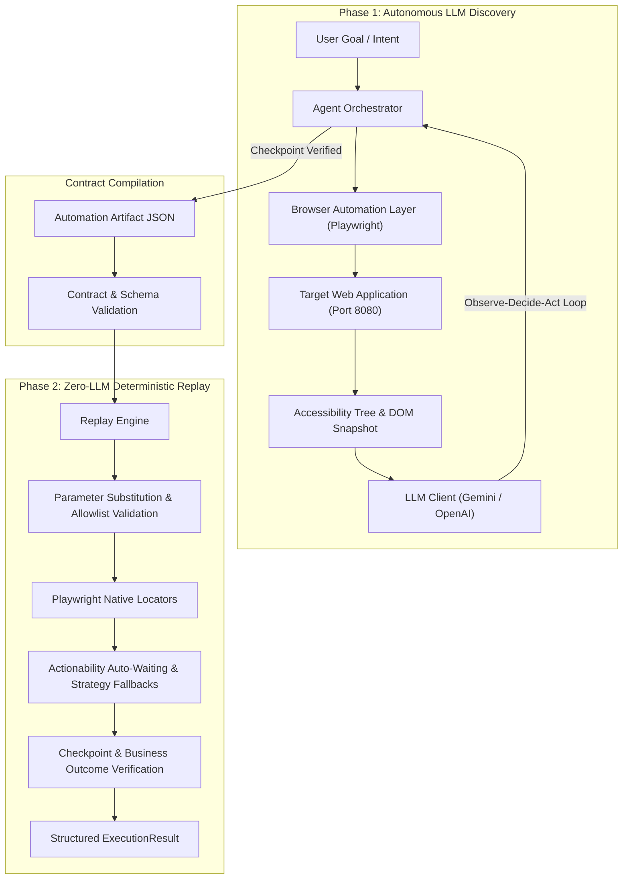
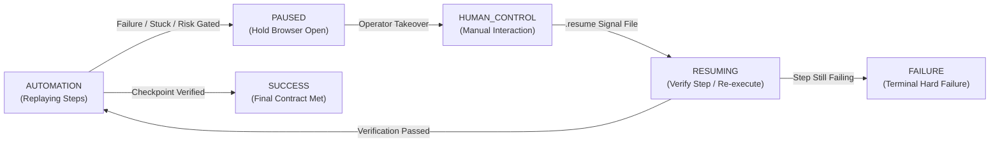

# Engineering Assessment Report: Computer-Use Automation & Deterministic Replay Engine

## 1. Architecture

The system implements a two-phase architecture designed to automate web applications lacking programmatic APIs:
1. **Goal-Driven LLM Discovery**: An autonomous agent decomposes a natural-language intent, observes the live accessibility tree and DOM state, decides actions, and executes them in a real browser session.
2. **Zero-LLM Deterministic Replay**: A Playwright-based execution engine that replays the discovered sequence deterministically with parameter substitution, fallback element resolution, risk gating, and checkpoint verification—without incurring LLM latency or token costs.



### Key Component Responsibilities
- **Agent Orchestrator** (`src/agent/orchestrator.py`): Coordinates the discovery loop. It extracts current page accessibility trees, invokes the LLM client, executes proposed actions, captures per-step screenshots, parameterizes typed values (e.g. matching `"12345"` to `{{member_id}}`), and records the discovery transcript.
- **LLM Client** (`src/agent/llm_client.py`): Communicates asynchronously via native REST with Google Gemini (`gemini-3.5-flash-lite`) or OpenAI (`gpt-4o`). Prompts mandate structured JSON output adhering to a strict schema (`action_type`, `target_role`, `target_name`, `target_selector`, `value`, `outputs`, `checkpoint`).
- **Browser Automation Layer** (`src/automation/browser.py`): Encapsulates Playwright Chromium automation. It strictly uses native Playwright Locators (`page.get_by_role`, `page.get_by_label`, `page.get_by_text`, `page.locator`), providing automatic waiting for visibility, enablement, and stability.
- **Replay Engine** (`src/artifact/replay_engine.py`): Executes serialized artifacts without any LLM dependencies. It performs parameter substitution, validates URL safety boundaries, evaluates risk tiers, handles element location fallbacks, and executes checkpoints.
- **Safety Guardrails** (`src/safety/guardrails.py`): Enforces URL allowlists before navigation and post-action, gates risky operations, and applies recursive PII redaction across all logs, data structures, and errors.
- **Escalation Manager** (`src/safety/escalation.py`): Orchestrates human-in-the-loop control transfer when an action fails or risk policies trigger, keeping the live session open and waiting for an operator resume signal.

---

## 2. Artifact Schema

The automation artifact (`src/artifact/schemas.py`) acts as an executable semantic contract between discovery and replay. It captures procedural actions, input/output specifications, completion verification conditions, and error recovery policies.

```json
{
  "metadata": {
    "version": "1.0",
    "created_at": "2026-09-15T03:44:53.331966",
    "target_app": "http://localhost:8080",
    "capability_name": "lookup_member_balance",
    "description": "Look up member account balance and profile information"
  },
  "parameters": {
    "member_id": {
      "type": "string",
      "description": "Input parameter member_id",
      "required": true
    }
  },
  "outputs": {
    "member_name": {
      "type": "string",
      "description": "Member's full name",
      "extract": {
        "selector": "#lookup-result",
        "regex": "Name:\\s*([^\\n\\t]+)",
        "group": 1
      }
    },
    "savings_balance": {
      "type": "number",
      "description": "Member savings account balance",
      "extract": {
        "selector": "#lookup-result",
        "regex": "Balance:\\s*\\$?([\\d,.]+)",
        "group": 1
      }
    }
  },
  "steps": [
    {
      "step_id": 1,
      "action_type": "navigate",
      "target": { "strategy": "semantic_selector", "value": "http://localhost:8080" },
      "value": "http://localhost:8080",
      "description": "Navigate to http://localhost:8080",
      "risk_level": "safe"
    },
    {
      "step_id": 2,
      "action_type": "type",
      "target": {
        "strategy": "accessibility_role",
        "value": "textbox:Member ID:",
        "role": "textbox",
        "name": "Member ID:",
        "fallback_strategies": ["text_content", "semantic_selector"]
      },
      "value": "{{member_id}}",
      "description": "Enter member ID into Member ID input",
      "risk_level": "safe"
    },
    {
      "step_id": 3,
      "action_type": "click",
      "target": {
        "strategy": "accessibility_role",
        "value": "button:Search",
        "role": "button",
        "name": "Search",
        "fallback_strategies": ["text_content", "semantic_selector"]
      },
      "description": "Click Search button",
      "risk_level": "safe"
    },
    {
      "step_id": 4,
      "action_type": "extract",
      "target": { "strategy": "semantic_selector", "value": "#lookup-result" },
      "output_key": "member_name",
      "regex": "Name:\\s*([^\\n\\t]+)",
      "description": "Extract member_name from #lookup-result",
      "risk_level": "safe"
    },
    {
      "step_id": 5,
      "action_type": "extract",
      "target": { "strategy": "semantic_selector", "value": "#lookup-result" },
      "output_key": "savings_balance",
      "regex": "Balance:\\s*\\$?([\\d,.]+)",
      "description": "Extract savings_balance from #lookup-result",
      "risk_level": "safe"
    }
  ],
  "checkpoint": {
    "step_id": 5,
    "condition": {
      "type": "element_visible",
      "target": { "strategy": "semantic_selector", "value": "#lookup-result" },
      "text_contains": "Member Found"
    },
    "description": "Verify lookup_member_balance interface completion"
  },
  "error_handlers": [
    {
      "error_type": "element_not_found",
      "fallback_strategy": "text_content_match",
      "description": "Fallback to text content matching"
    },
    {
      "error_type": "timeout",
      "fallback_strategy": "increase_wait_time",
      "description": "Retry with increased wait timeout"
    }
  ],
  "business_outcome_rules": [
    {
      "outcome": "member_not_found",
      "selector": "#lookup-result",
      "text_contains": "Member not found"
    }
  ]
}
```

### Design Rationale
- **Parameterized Placeholders**: Values typed during discovery matching input parameters are abstracted as `{{parameter_name}}`, enabling dynamic replay across different records.
- **1-to-1 Extraction & Self-Describing Output Schema**: Each declared output corresponds strictly to an explicit `EXTRACT` step (`outputs.keys() == {s.output_key for extract steps}`). Outputs define an optional `extract: {selector, regex, group}` contract, allowing the deterministic engine to parse fields out of multi-field UI cards with regular expression extraction and apply type coercion (`number` parsed as numeric float stripping currency/commas, `boolean` as bool, strings stripped of tabs and newlines).
- **Disjoint Business Rules vs Error Handlers**: Business outcome indicators are isolated in `business_outcome_rules` with mandatory explicit `selector` attributes, rather than conflated with technical runtime errors.

---

## 3. Determinism & Error Handling

Achieving zero-LLM determinism in legacy environments requires handling UI timing variations, layout changes, and distinguishing business logic results from technical faults.

### 1. Robust Playwright Locator Strategy
- **No `query_selector`**: All element resolution uses native Playwright Locators (`page.get_by_role`, `page.get_by_label`, `page.get_by_text`).
- **Exact-First Matching**: When resolving by role and accessible name, the system queries `exact=True` first, falling back to substring matching only if unattached.
- **Auto-Waiting**: Playwright automatically waits for elements to be attached, visible, stable, and receive pointer events, eliminating arbitrary hardcoded sleeps.
- **Fallback Cascades**: If an `ACCESSIBILITY_ROLE` locator fails, the engine cascades to `SEMANTIC_SELECTOR` (e.g., `#member-id`), followed by `TEXT_CONTENT`.

### 2. Disjoint Terminal States
The engine returns an `ExecutionResult` with strictly disjoint terminal states:
- `SUCCESS`: Every step completed and checkpoint condition verified.
- `BUSINESS_OUTCOME`: The target application rendered a valid business domain result (e.g., `"Member not found"`).
- `FAILURE`: An unrecoverable technical error occurred (e.g., element missing after all fallbacks, browser crash, network timeout).
- `NEEDS_CONFIRMATION`: Replay halted on a policy-gated `RISKY` action without explicit approval.

### 3. Error Classification Taxonomy
The replay engine inspects page state to identify business outcomes *before* technical error classification:
```python
# From src/artifact/replay_engine.py
async def _detect_page_business_outcome(self, artifact: AutomationArtifact) -> Optional[Dict[str, str]]:
    rules = getattr(artifact, "business_outcome_rules", [])
    for rule in rules:
        candidates = [rule.selector] if rule.selector else ["#lookup-result", ".result", "body"]
        for selector in candidates:
            loc = self.browser.page.locator(selector)
            if await loc.count() > 0 and await loc.first.is_visible():
                txt = await loc.first.inner_text()
                if rule.text_contains.lower() in txt.lower():
                    return {"outcome": rule.outcome, "evidence_text": txt.strip()}
    return None
```
Under this architecture:
- Technical faults (`net::ERR_CONNECTION_REFUSED`, `Page crashed`, `Timeout 30000ms`) never match business outcomes and are correctly classified as `FAILURE`.
- When member `99999` is looked up, the DOM renders `"Member not found"`, returning `ExecutionStatus.BUSINESS_OUTCOME` with 0 retries and clean termination.

---

## 4. Heterogeneity & Multi-Tenant

Enterprise banking environments often involve dozens of tenant institutions running differing versions or configurations of the same underlying core platform.

### Cross-Tenant Strategy
1. **Canonical Base Artifacts**: Core capabilities (e.g., `lookup_member_balance`) are captured on a baseline instance. The artifact captures semantic accessibility roles rather than fragile CSS paths or absolute coordinates.
2. **Tenant Parameter Overrides**: Tenant differences in credentials, institution routing IDs, or account formatting are injected dynamically via `parameters`.
3. **Selector Aliases & Fallbacks**: The artifact schema supports `fallback_strategies` and custom selectors per step, allowing an artifact to accommodate minor branding or template divergences without script duplication.
4. **Tenant Metadata Tagging**: Artifact metadata includes `tenant_id` and `app_version` attributes, allowing tenant-specific variations to be cataloged and selected dynamically.

---

## 5. Escalation & Handoff

When automation encounters an ambiguous state, unexpected dialog, consecutive failures, or a high-stakes irreversible write action, autonomous execution pauses and transfers control to a human operator.

### Control State Machine


```
[AUTOMATION] ──(Failure / Stuck / Risk Gate)──> [PAUSED]
                                                   │
                                     (Operator Takeover)
                                                   ▼
[AUTOMATION] <───(Resume Signal)─── [RESUMING] <─── [HUMAN_CONTROL]
```

### Implementation Mechanics
1. **Detection**: Stuck states are detected when step counts exceed limits, three consecutive action attempts fail, or risk gates trigger.
2. **Context Snapshot**: An `InterventionRequest` is generated containing the capability name, current step ID, failure reason, active URL, page text, and a live screenshot.
3. **Structured Audit Record**: The request is written to `evidence/interventions/<run_id>.json` with paths normalized to forward slashes.
4. **Non-Blocking Control Transfer**: The automation holds the live Playwright browser context open without terminating the session and enters an asynchronous wait loop.
5. **Resume Signal**: Operators complete required actions in the browser and signal resumption via a signal file (`evidence/interventions/<run_id>.resume`).
6. **Strict Post-Resume Verification**: After receiving a resume signal, the engine does not infer success from generic page elements (such as presence of `h2` or `body`). Instead, it strictly evaluates:
   - If the step defines an explicit `postcondition: CheckpointCondition`, that condition is verified.
   - Otherwise, the step itself is re-executed once via `_execute_step`.
   - If verification fails or the re-execution fails, the run terminates immediately with `ExecutionStatus.FAILURE` and `observed="step re-executed after operator intervention and still failed"`.

### Human Action Capture Mechanics & Limitations
The current implementation captures human intervention using state differentials and metadata rather than a continuous low-level DOM event trace:
- **What is recorded**: Before-and-after URL comparison (`url_before`, `url_after`, `url_changed`), page text diffing (`dom_changed` checking whether DOM text altered during human takeover), elapsed operator duration, and optional operator notes provided in the `.resume` signal file.
- **Why this is not an action trace**: The system does not attach continuous CDP (Chrome DevTools Protocol) event listeners for every mouse click, coordinate, keystroke, or scroll event that occurred during operator control.
- **What a real production action trace would require**: A production action recording seam would require injecting an in-page recorder (e.g. rrweb or a custom MutationObserver/event-listener harness) or attaching CDP session listeners (`Input.dispatchMouseEvent`, `DOM.mutationEvent`, `Runtime.addBinding`) to stream full user interactions into reproducible automation steps.

---

## 6. Safety

The system implements multi-layered guardrails designed to prevent accidental financial loss, unauthorized exfiltration, or regulated data leakage.

### 1. Allowlist Enforcement
- **Pre-Navigation Check**: Before any `page.goto()`, the target URL's domain is validated against `ALLOWED_DOMAINS` (`localhost`, `127.0.0.1`). Unlisted domains (e.g., `http://attacker.example/exfil`) are rejected.
- **Post-Action Boundary Check**: After every `click` or form action, the current page URL is re-evaluated. If an unexpected off-domain redirect occurs, automation halts immediately and records an error screenshot.

### 2. Action Risk Classification & Gating
Actions are categorized by risk level:
- `SAFE`: Read-only queries (`navigate`, `extract`, `wait`).
- `REVERSIBLE`: Standard low-impact inputs (`type`, `select`).
- `RISKY`: High-impact write actions (e.g., `Freeze Account`, fund transfers).
- `IRREVERSIBLE`: Destructive actions requiring explicit operator confirmation.

When replaying without authorization flags, encountering a `RISKY` action immediately halts execution with status `NEEDS_CONFIRMATION` (verified in `account_management.json` step 6). Replay requires `--approve-risky` to proceed.

**Production Authorization Model**:
In production environments, `approve_risky` may **only** be asserted by authorized human operators or an upstream enterprise policy service, **never** by the invoking LLM agent or autonomous callers. Control flags are strictly isolated in a dedicated `RunOptions` object passed as a separate argument from runtime `params` (ensuring no `{{template}}` parameter injection can self-approve risky steps). Furthermore, the authorizing entity (`approved_by`) and approval tokens are permanently recorded in the execution result and evidence logs.

### 3. Recursive PII Redaction
All data structures, logging streams, and error records are processed by `redact_sensitive_data`:
- US Social Security Numbers (`\b\d{3}-\d{2}-\d{4}\b`) -> `***REDACTED_SSN***`
- Financial Account Numbers (9 to 17 digits) -> `***REDACTED_ACCT***`
- Currency Amounts (`\$\s?\d[\d,]*\.\d{2}`) -> `***REDACTED_CURRENCY***`
- 5–8 digit numeric IDs when under dictionary keys containing `member` or `id` -> `***REDACTED_ID***`
- Bearer tokens and API keys (`Bearer [A-Za-z0-9_-]+`, `sk-...`)
- Regulated keyword fields (`ssn`, `password`, `pin`, `cvv`, `token`, `secret`, `api_key`) are recursively masked across nested dictionaries, lists, and strings.
- Extracted values are treated as sensitive by default in browser logs: only character length and SHA-256 hash are emitted.
- Escalation intervention records store a strictly redacted excerpt ($\le 300$ characters) rather than raw full-page DOM dumps.

#### Explicit Redaction Boundaries & Limitations (What Still Leaks & Why)
- **Arbitrary Human Names in Unstructured Text**: Arbitrary human names appearing in free-form DOM text cannot be reliably detected or redacted using static regular expressions without incurring extreme false-positive rates on common English nouns or necessitating heavyweight natural-language named-entity recognition (NER) models. In production, enterprise data loss prevention (DLP) pipelines (e.g., Google Cloud DLP or AWS Comprehend) process streaming logs. For this local synthetic evaluation, known persona names are scrubbed from serialized logs and evidence, but general arbitrary names in unstructured text remain unredacted unless bound to an explicit dictionary key (`member_name`).
- **Rendered Screenshots**: Full-page visual PNG screenshots captured during discovery and intervention contain raw rendered pixels of the application UI. Server-side pixel blurring is intentionally out of scope for this CLI engine and must be applied by upstream evidence storage layers before public dissemination.

---

## 7. Cuts — What I Deliberately Left Out & What I'd Build Next

To preserve engineering focus and adhere to the brief's evaluation criteria (depth over breadth; prioritizing core execution over speculative infrastructure), I deliberately cut several non-essential components, while defining concrete paths for future production iterations.

### What I Deliberately Left Out

1. **Operator Console UI**:
   - *What I cut*: A full WebSocket-driven web dashboard or co-browsing GUI for human operators.
   - *What I built*: A robust state machine, structured JSON intervention records (`evidence/interventions/`), and atomic file-based resume signaling (`.resume`) that integrates directly with any external console or ticketing webhook.
2. **Desktop OS Automation**:
   - *What I cut*: Native OS GUI drivers (e.g. Windows pywinauto or macOS Accessibility APIs).
   - *What I built*: A web-focused Playwright driver utilizing accessibility tree concepts (`get_by_role`, `get_by_label`) that directly translates to desktop accessibility primitives without architectural rework.
3. **Multi-Tenant Automated Canonicalization**:
   - *What I cut*: Autonomous clustering algorithms to automatically infer and merge artifacts across dozens of tenant variants.
   - *What I built*: Parameterized contracts (`{{member_id}}`), dynamic extraction targets, and tenant metadata fields that support rule-based and manual cross-tenant specialization.
4. **Mock Discovery Elimination**:
   - *What I cut*: All legacy mock discovery scripts (`mock_discovery*.py`).
   - *What I built*: Authentic live discovery in `main.py discovery` powered by real asynchronous Google Gemini REST integration, verified in 4.52 seconds against `http://localhost:8080`.
5. **Auxiliary Deployment & Cataloging Infrastructure**:
   - *What I cut*: Auxiliary deployment packaging (`Dockerfile`, `docker-compose.yml`, `DEPLOYMENT.md`, `.github/workflows/deploy-pages.yml`), compliance checklists, and mock marketplace cataloging (`src/artifact/marketplace.py`, `src/artifact/metrics.py`).
   - *Why I cut it*: Out-of-scope for core computer-use automation. The brief specifically penalizes speculative packaging and rewards depth in real browser interaction, deterministic replay, safety boundaries, and human escalation.

### What I'd Build Next (Production Roadmap)

With additional engineering investment, the next highest-impact capabilities I would introduce are:

1. **CDP-Level Action Trace Streaming**:
   - *Objective*: Replace the current state-differential capture (`url_before`, `url_after`, `dom_changed`) with granular event-level recording during operator intervention.
   - *Design*: Attach a Chrome DevTools Protocol (CDP) session listener (`Input.dispatchMouseEvent`, `Input.dispatchKeyEvent`, `Runtime.addBinding`) inside `wait_for_resume` to record raw human interactions directly into synthesizable Playwright action steps.
2. **Cryptographic Authorization Tokens**:
   - *Objective*: Enforce non-repudiable policy checks for high-risk operations in multi-tenant environments.
   - *Design*: Introduce asymmetric signature verification (e.g. Ed25519 or RS256 JWT) on `RunOptions.approval_token`. High-risk steps (e.g., fund transfers, account freezing) would require a signed token issued by an enterprise authorization gateway before execution.
3. **Automated Visual UI Masking**:
   - *Objective*: Prevent visual PII exposure in failure and escalation screenshots.
   - *Design*: Implement client-side bounding-box masking using DOM element positions or an on-device OCR model prior to saving PNG files in `logs/` and `evidence/interventions/`, ensuring full HIPAA/GLBA visual compliance.
4. **Assisted Step-Level Fallback (Bounded LLM Recovery)**:
   - *Objective*: Mitigate runtime breakage caused by minor application redesigns without re-running full multi-step discovery.
   - *Design*: When a locator fails across all deterministic strategies, invoke a bounded LLM recovery call scoped strictly to the current step and target DOM subtree, gated by policy and logged to evidence.
5. **Cross-Tenant Artifact Overlays**:
   - *Objective*: Eliminate script duplication across institutions running the same vendor application with slight branding or layout variations.
   - *Design*: Implement an inheritance hierarchy where tenant-specific artifacts declare a `base_artifact` and override only divergent step locators or timing parameters.