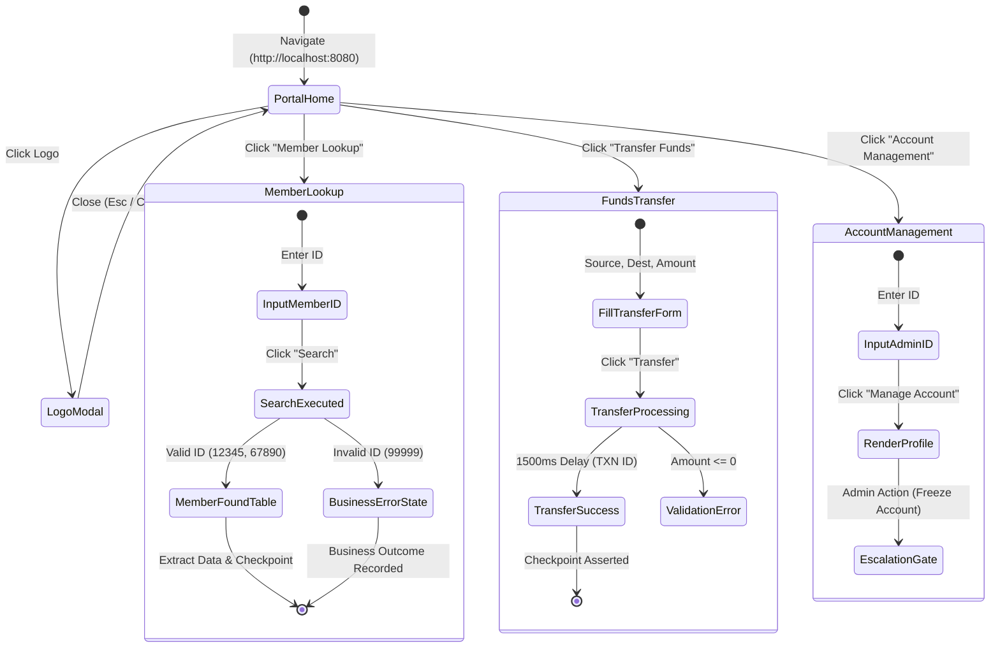

# Target Banking Application — Developer Specification & Workflow Architecture

This document provides a comprehensive developer-level breakdown of the **NeuroZero Banking Portal** (`target-app/index.html`). It documents the DOM architecture, state machines, accessibility locators, and how the **NeuroZero Replay** engine interacts with each workflow.

---

## 1. Architectural Philosophy

In enterprise banking and credit union operations, core banking software (e.g., Fiserv, FIS, Jack Henry) frequently lacks modern REST or GraphQL APIs. Automation systems must interact with browser-based portals reliably.

The NeuroZero Banking Portal was engineered specifically to benchmark **agentic computer-use systems**:
* **Accessibility-Tree First:** All interactive controls expose explicit ARIA roles, labels, and structured IDs, allowing Playwright to locate elements reliably across DOM shifts.
* **Asynchronous Latency:** Simulated network lag tests dynamic checkpoint assertion rather than static, brittle delays.
* **Business Outcome Disambiguation:** Differentiates valid task completions with negative results (e.g., non-existent member) from technical runtime crashes.

---

## 2. Interactive Workflow State Machine



---

## 3. Comprehensive Button, Input & Locator Matrix

| Component | UI Element | DOM Selector | Playwright Locator Strategy | Action Type | Risk Level | Engine Behavior / Checkpoint |
| :--- | :--- | :--- | :--- | :---: | :---: | :--- |
| **Branding** | Header Logo | `.header-logo` | `role=img[name="NeuroZero Replay Logo"]` | `click` | `SAFE` | Opens high-resolution modal lightbox. |
| **Branding** | Modal Close | `#logo-modal button` | `text="Close"` | `click` | `SAFE` | Dismisses modal; resets viewport focus. |
| **Navigation** | Lookup Tab | `.nav button:nth-child(1)` | `role=button[name="Member Lookup"]` | `click` | `SAFE` | Activates `#lookup-page`, hides other cards. |
| **Navigation** | Transfer Tab | `.nav button:nth-child(2)` | `role=button[name="Transfer Funds"]` | `click` | `SAFE` | Activates `#transfer-page`. |
| **Navigation** | Account Tab | `.nav button:nth-child(3)` | `role=button[name="Account Management"]` | `click` | `SAFE` | Activates `#account-page`. |
| **Lookup** | Member ID Field | `#member-id` | `label="Member ID:" >> input` | `type` | `SAFE` | Dynamic runtime parameter substitution (`{{member_id}}`). |
| **Lookup** | Search Button | `#lookup-page button:has-text("Search")` | `role=button[name="Search"]` | `click` | `SAFE` | Triggers `lookupMember()`; initiates table extraction. |
| **Lookup** | Clear Button | `#lookup-page button.secondary` | `role=button[name="Clear"]` | `click` | `SAFE` | Clears text inputs and unmounts result DOM nodes. |
| **Lookup Result** | Result Container| `#lookup-result` | `id="lookup-result"` | `extract` | `SAFE` | Validates `Checkpoint`: element contains "Member Found". |
| **Transfer** | From Account | `#from-account` | `input[id="from-account"]` | `type` | `SAFE` | Injects source account string. |
| **Transfer** | To Account | `#to-account` | `input[id="to-account"]` | `type` | `SAFE` | Injects destination account string. |
| **Transfer** | Amount | `#amount` | `input[id="amount"]` | `type` | `SAFE` | Validates float input > 0. |
| **Transfer** | Submit Button | `#transfer-page button:has-text("Transfer")`| `role=button[name="Transfer"]` | `submit` | `RISKY` | Policy guardrail triggers confirmation check. |
| **Transfer Result**| Transfer Status | `#transfer-result` | `id="transfer-result"` | `extract` | `SAFE` | Waits for `TXN` prefix in confirmation string. |
| **Management** | Account Admin ID| `#account-mgmt-id` | `input[id="account-mgmt-id"]` | `type` | `SAFE` | Injects target account ID for administrative review. |
| **Management** | Freeze Account | `button:has-text("Freeze Account")` | `role=button[name="Freeze Account"]` | `confirm`| `CRITICAL`| Triggers **Human Escalation Gate** (Section 3.6). |

---

## 4. Test Accounts & Behavioral Vectors

The built-in mock database provides deterministic test vectors for automated replay verification:

### 4.1 Workflow 1: Member Lookup Test Vectors

| Member ID | Account Holder | Account Type | Balance | Account Status | Expected Execution Path / UI Assertion |
| :---: | :--- | :---: | :---: | :---: | :--- |
| **`12345`** | John Smith | Savings | `$5,432.50` | `Active` | **Primary Happy Path**: Renders green table; extracts balance & status. |
| **`67890`** | Jane Johnson | Checking | `$12,500.00` | `Active` | **High Balance Test**: Renders green table; multi-parameter verification. |
| **`11111`** | Bob Williams | Savings | `$890.25` | `Frozen` | **Status Branching**: Demonstrates retrieval of compliance-locked account. |
| **`22222`** | Alice Brown | Checking | `$0.00` | `Closed` | **Zero-Balance Vector**: Validates numerical edge condition ($0.00). |
| **`99999`** | *None* | *None* | *N/A* | *Non-existent* | **Business Error Handler**: Red banner *"Member not found..."* |
| *(empty)* | *None* | *None* | *N/A* | *Validation* | **Validation Error**: Red banner *"Please enter a member ID"*. |

---

### 4.2 Workflow 2: Transfer Funds Test Scenarios

The Transfer Funds workflow tests asynchronous state machines, business compliance guardrails, input validations, and cross-workflow balance persistence:

| Scenario # | Test Case / Intent | From Account | To Account | Amount | Expected UI Response & Timing | Underlying Architectural Assertion |
| :---: | :--- | :---: | :---: | :---: | :--- | :--- |
| **TF-01** | **Happy Path Transfer** *(Core Banking)* | `12345` | `67890` | `250.00` | **Phase 1 (0–1.5s):** Blue info banner *"Processing transfer..."*<br>**Phase 2 (1.5s+):** Green success card with `TXN<timestamp>` hash and member labels.<br>*(In-memory balance updates: 12345 becomes $5,182.50)* | **Asynchronous Checkpoint Assertion:** Replay engine waits for DOM state transition from `info` to `success` and regex-matches `TXN` prefix. |
| **TF-02** | **Frozen Account Guardrail** *(Compliance)* | `11111` | `67890` | `100.00` | **Instant Red Error:** *"Transfer Failed: Source account 11111 (Bob Williams) is Frozen. Fund transfers are restricted by compliance."* | **Business Outcome vs Crash:** Engine records `account_frozen` business outcome; verifies funds cannot leave compliance-locked accounts. |
| **TF-03** | **Closed Account Guardrail** *(Lifecycle)* | `22222` | `67890` | `50.00` | **Instant Red Error:** *"Transfer Failed: Source account 22222 (Alice Brown) is Closed. No transactions permitted."* | **Account Lifecycle Integrity:** Blocks transfers on zero-balance closed ledger accounts. |
| **TF-04** | **Insufficient Funds** *(Ledger Limit)* | `12345` | `67890` | `10000.00` | **Instant Red Error:** *"Transfer Failed: Insufficient funds in account 12345. Available balance: $5,432.50."* | **Overdraft Guardrail:** Replay engine detects `insufficient_funds` without crashing; handles business exception gracefully. |
| **TF-05** | **Zero / Negative Value** *(Input Validation)* | `12345` | `67890` | `0` or `-50` | **Instant Red Error:** *"Amount must be greater than 0"* | **Input Boundary Assertion:** Handled by `invalid_amount` error handler. |
| **TF-06** | **Missing Fields Validation** *(Form Integrity)* | *(empty)* | `67890` | `100.00` | **Instant Red Error:** *"Please fill in all fields"* | **Form Completeness Assertion:** Handled by `validation_error` error handler. |
| **TF-07** | **Arbitrary Account Transfer** *(Generic Routing)* | `ACCT-900` | `ACCT-400` | `75.00` | **Phase 1:** Blue info banner.<br>**Phase 2:** Green success card with `TXN<timestamp>`. | **External Clearing Routing:** Validates that non-mock external accounts route cleanly through standard rails. |

---

## 5. Business Outcome vs. System Failure Handling

A core differentiator of NeuroZero Replay is distinguishing **Business Outcomes** from **Technical Failures**:

```
+-----------------------------------------------------------------------------------+
|                              EXECUTION OUTCOME TAXONOMY                           |
+--------------------------------------------------+--------------------------------+
|          BUSINESS OUTCOME (Success: True)        |   SYSTEM FAILURE (Success: False) |
+--------------------------------------------------+--------------------------------+
| Definition: The workflow executed to completion, | Definition: Technical breakage |
| but the business domain returned a negative or   | preventing goal completion     |
| alternative resolution.                          | (bug, crash, selector break).  |
|                                                  |                                |
| Examples:                                        | Examples:                      |
| • "Member not found" (#lookup-result error)      | • Network timeout (> 3000ms)   |
| • "Insufficient funds" for transfer              | • Missing DOM element selector |
| • "Account already closed"                       | • HTTP 500 server crash        |
|                                                  |                                |
| Engine Response:                                 | Engine Response:               |
| -> Return structured output:                     | -> Execute location fallback   |
|    `{"status": "member_not_found"}`              | -> Retries with backoff        |
| -> Mark step as COMPLETED                        | -> Escalate to human operator  |
+--------------------------------------------------+--------------------------------+
```

---

## 6. How to Run & Verify Locally

```powershell
# 1. Launch the banking portal
python -m http.server 8080 --directory target-app

# 2. In another terminal, run automated replay against this portal
python test_replay.py

# 3. Run visual live demonstration with visible Playwright browser
python demo_live.py
```
